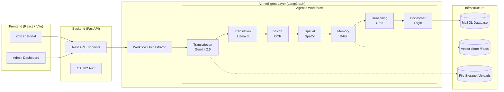

# 🏗️ System Architecture: Multi-Agent Civic AI

This document provides a formal architectural overview of the **Civic Issue Management System**, focusing on the **LangGraph-driven** multi-agent workflow.

---

## 1. High-Level System Architecture

The system is built using a **Decoupled Three-Tier Architecture**, with a specialized **AI Intelligent Layer** sitting between the API and the Database.

---

## 2. Component Breakdown

### **A. Orchestration Layer (LangGraph)**
Instead of a simple linear script, the system uses **LangGraph** to manage a stateful cycle.
*   **AgentState**: A shared memory object that stores the raw input, processed text, detected coordinates, and final AI insights.
*   **State Machine**: Ensures that if one agent fails (e.g., Translation), the system can gracefully proceed with a fallback or error log without crashing.

### **B. The 7-Agent Functional Architecture**

| Layer | Agent Name | Technical Stack | Input -> Output |
| :--- | :--- | :--- | :--- |
| **Ingestion** | **Transcription** | Gemini 2.5 Flash | Audio (WAV) -> Regional Text |
| **Refinement** | **Translation** | Groq (Llama 70B) | Regional Text -> Standard English |
| **Context** | **Vision OCR** | Pytesseract / PIL | Evidence Photo -> Text Metadata |
| **Spatial** | **Proximity** | SpaCy + Geo-Logic | GPS -> Landmark Priority (e.g. "Near Hospital") |
| **History** | **RAG** | Sentence-Transformers | English Text -> Similar Ticket IDs |
| **Intelligence**| **Reasoning** | Groq / Gemini | Full Context -> JSON (Category, Priority) |
| **Execution** | **Dispatcher** | Python Logic | JSON -> Department Routing + SLA |

### **C. Model Layer (The "Silicon Brains")**
*   **Multimodal (Gemini 2.5 Flash)**: Specifically chosen for its massive context window and ability to accurately transcribe audio files while staying cost-effective.
*   **Ultra-Low Latency (Groq)**: Powers the Translation and Reasoning steps. It allows the system to process a complex 7-step chain in under 3 seconds.
*   **Local NLP (SpaCy)**: Performs Entity Recognition on the fly to detect street names or locations that LLMs might hallucinate.

### **D. Persistence Layer (Reliability)**
*   **Relational (MySQL)**: Stores complaints, users, and admin status updates.
*   **Vectorized (Faiss)**: Stores high-dimensional embeddings of previous complaints to power the RAG Agent.

---

## 3. Data Flow Sequence
1.  **Citizen Trigger**: Submits a report via FastAPI.
2.  **State Initialization**: Orchestrator creates the `AgentState` object.
3.  **Cyclic Execution**: LangGraph moves through nodes `Transcription` -> `Translation` -> `Vision` -> `Proximity` -> `RAG` -> `Reasoning` -> `Routing`.
4.  **Enrichment**: Each agent "decorates" the state object with its own analysis.
5.  **Finalization**: The system commits the enriched state (category, boosted priority, department) to the SQL database.
6.  **Admin Notify**: The ticket appears on the dashboard with a full **"AI Rationale"** report.
