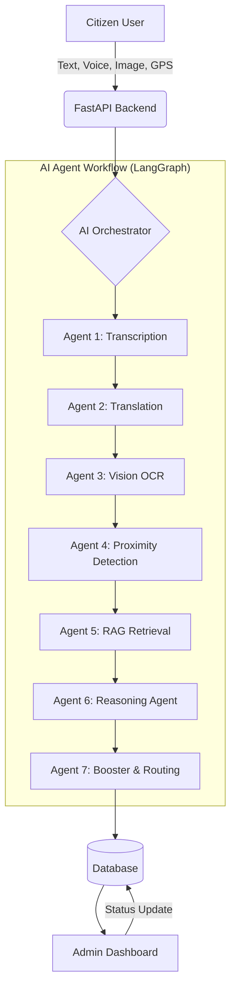

# 🏙️ Civic Issue Management System: Solution Flow

This document outlines the end-to-end technical flow of how a civic complaint is processed, analyzed, and routed using advanced AI Agents and LangGraph orchestration.

---

## 🛰️ 1. High-Level Architecture
The system follows a modular "Agent-per-Task" architecture, orchestrated by **LangGraph** to ensure stateful and reliable transitions between different AI capabilities.

---

## 🛠️ 2. Detailed Step-by-Step Flow

### **Step 1: Input Acquisition (Frontend)**
*   **Source**: Mobile App / Web Portal.
*   **Payload**: `description`, `image_file`, `audio_file`, `gps_coordinates`, `area`.

### **Step 2: AI Orchestration (State Management)**
The `CivicWorkflowOrchestrator` initializes a shared **AgentState** that carries all context through the pipeline.

### **Step 3: The 7-Agent Pipeline**

#### **Agent 1: Transcription (Gemini 2.5 Flash)**
*   **Task**: Converts voice recordings into text.
*   **Capability**: Supports multi-lingual audio (Tamil, Hindi, English).
*   **Stability**: Implements a wait-loop to ensure file processing is complete before generating text.

#### **Agent 2: Translation (Groq - Llama 3)**
*   **Task**: Translates "Tanglish" or regional languages into professional English.
*   **Why**: Normalizes the input for consistent classification by later agents.

#### **Agent 3: Vision Context (OCR)**
*   **Task**: Extracts text from images (e.g., street signs, shop names).
*   **Tool**: Pytesseract / PIL.
*   **Context**: Appends findings to the English text as `[Ref: OCR Content]`.

#### **Agent 4: Proximity & Urgency (Geo-Landmarking)**
*   **Landmark DB**: Checks GPS against hospital/school coordinates.
*   **NLP**: Scans for urgency keywords (e.g., "Critical", "Danger", "Child").
*   **Output**: Identifies if the issue is near a high-priority zone.

#### **Agent 5: RAG Retrieval (Faiss + Embeddings)**
*   **Task**: Searches for similar historical cases in the Knowledge Base.
*   **Goal**: Provides context on how previous similar issues were handled.

#### **Agent 6: Reasoning (Classification & Priority)**
*   **Task**: Categorizes the issue and assigns a BASE priority.
*   **Model**: Groq (Primary) / Gemini (Fallback).
*   **Categories**: Potholes, Garbage, Mosquito Menace, Dead Animals, etc.

#### **Agent 7: Smart Boosting & Routing**
*   **Priority Boost**: Increases priority level based on Agent 4's findings (e.g., Medium -> Critical because it's near a Hospital).
*   **Department Routing**: Maps category to specific departments (e.g., Health Dept, Roads Dept).
*   **SLA/ETA**: Assigns timeframes (e.g., Critical = 4 Hours, Low = 72 Hours).

---

## 📦 3. Data Persistence & Monitoring
1.  **Storage**: The final `AnalysisOutput` is stored in the `complaints` table.
2.  **Admin UI**: Admins see the **AI Logic & Insight** tab, which explains exactly *why* the AI made its routing and priority decisions.
3.  **Audit Trail**: All steps are logged for transparency.

---

## 📈 4. Key Performance Indicators (KPIs)
*   **Accuracy**: >95% categorization accuracy using Llama-3-70B.
*   **Latency**: Full pipeline execution in ~2-5 seconds.
*   **Automation**: 80% reduction in manual triage effort.
